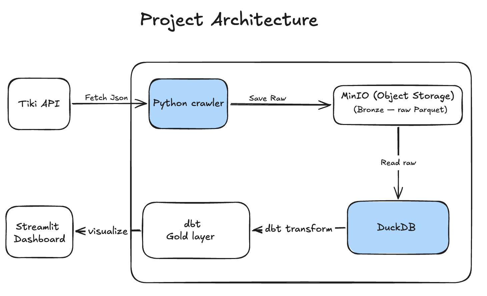
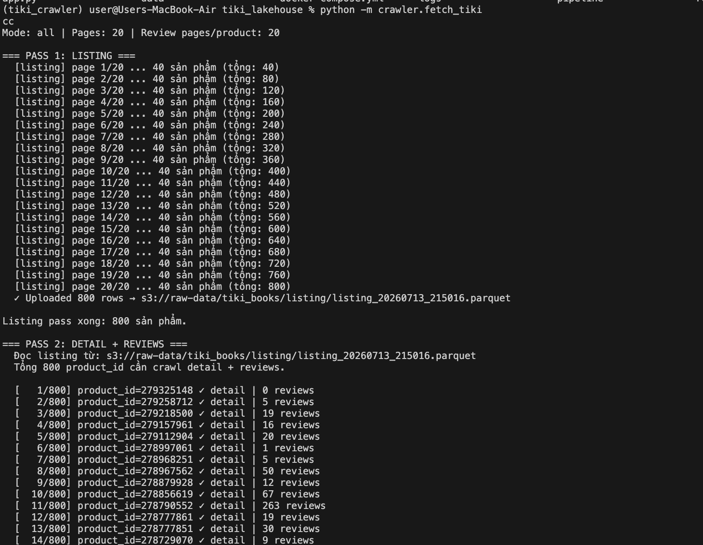
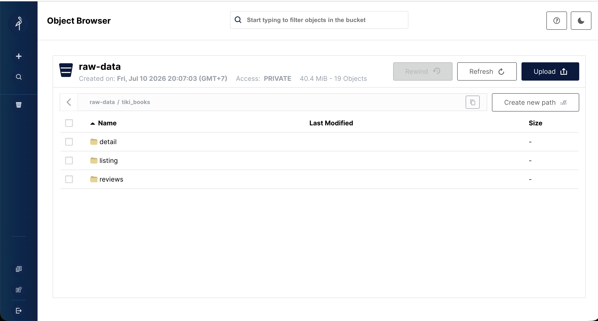
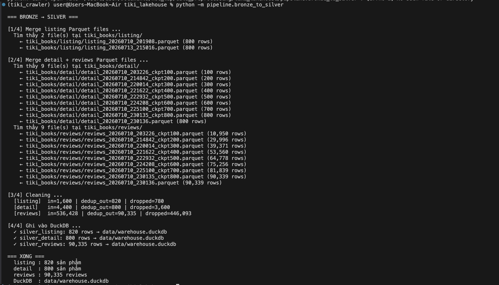
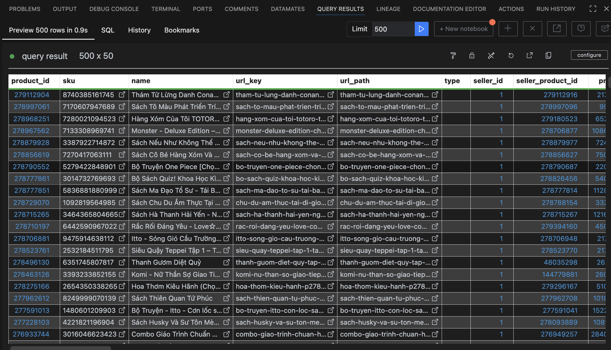
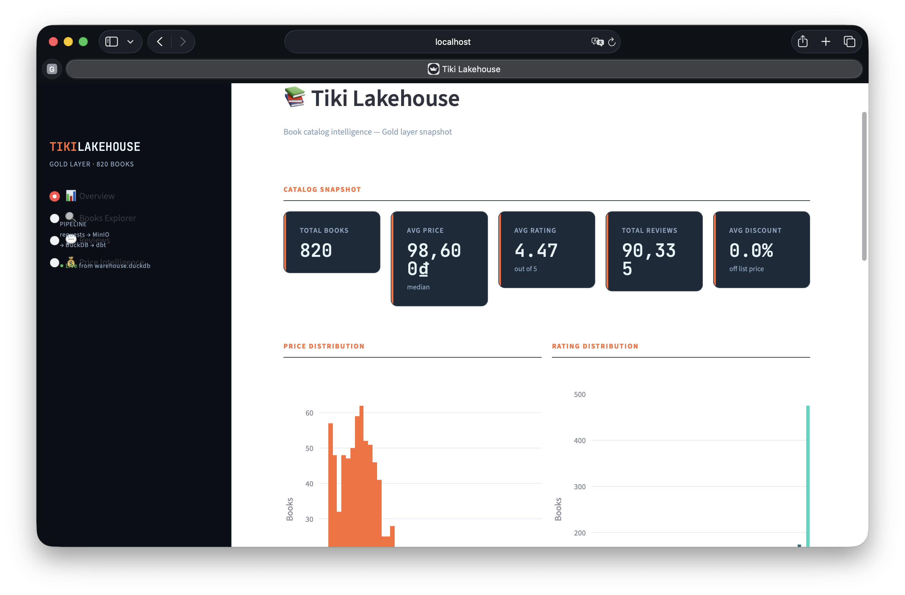

# Tiki raw to lakehouse

> A production-style data lakehouse pipeline built on Vietnamese e-commerce data — from raw API crawl to interactive analytics dashboard.


---

## Introduction

**Tiki Lakehouse** is an end-to-end project that crawls the [Tiki.vn](https://tiki.vn) books catalog, processes it through a medallion lakehouse architecture, and surfaces insights via an interactive Streamlit dashboard.

### Why this project?

AI-powered applications — recommendation engines, book assistant chatbots, semantic search — are only as good as the data feeding them. Raw e-commerce data from APIs is noisy, inconsistent, and deeply nested. Without a reliable data foundation, downstream AI systems produce unreliable results.

Tiki Lakehouse was built to bridge that gap: a structured, clean, and well-modeled dataset that can serve as the data backbone for systems like:

- **Recommendation engines** — leveraging ratings, sales velocity, discount tiers, and category signals to surface relevant books
- **AI book assistants** — grounding LLM responses with structured metadata (publisher, specs, reviews) instead of hallucinated facts
- **Semantic search** — enriched book descriptions and verified review content ready for embedding and vector indexing

On the engineering side, the project demonstrates the full lifecycle of a production-grade data pipeline: crawling a live API, landing raw data in object storage, cleaning and modeling through a medallion architecture, and delivering insights via an interactive dashboard.

### What does it solve?

The Vietnamese book market on Tiki has **800+ books and 90,000+ reviews** but no unified analytics surface. This project answers questions like:

- Which publishers dominate the catalog, and how do they price?
- What discount tiers actually correlate with higher ratings or sales velocity?
- How do verified-purchase reviews compare to unverified ones?
- Which books are underpriced relative to their rating and review volume?

---

## Architecture



---

## Data Flow

| Layer | Storage | Description |
|-------|---------|-------------|
| **Bronze** | MinIO (`raw-data/tiki_books/`) | Raw Parquet files from API — listings, product detail, reviews. Append-only, no transformation. |
| **Silver** | DuckDB (`silver_listing`, `silver_detail`, `silver_reviews`) | Deduplicated, cleaned, flattened. Extracts nested fields (`quantity_sold`, `spec_*`), nullifies invalid prices. |
| **Gold** | DuckDB (`fct_tiki_books`, `fct_tiki_reviews`) | Business-ready mart tables built by dbt. Computes `discount_pct`, `has_reviews`, joins reviews to book metadata. |

---

## Screenshots

### Step 1 — Crawling Tiki API
Two-pass crawler fetching listings, product detail, and reviews from Tiki.vn with checkpointing every 100 products.



### Step 2 — Bronze Layer (MinIO)
Raw Parquet files landing in MinIO under `raw-data/tiki_books/` — listings, detail, and reviews partitioned by extraction run.



### Step 3 — Silver Layer (DuckDB)
`bronze_to_silver.py` merging, deduplicating, and cleaning all Parquet files into three structured DuckDB tables.



### Step 4 — Gold Layer (dbt)
`dbt run` building staging views and mart tables — `fct_tiki_books` and `fct_tiki_reviews` — with lineage visible in the dbt output.



### Step 5 — Streamlit Dashboard
Interactive analytics dashboard running locally against the Gold layer — 4 pages, dark theme.



---

## Features

### 1. Overview
High-level market snapshot — KPI cards, price distribution, rating breakdown, top publishers, and a discount vs. rating scatter plot.


### 2. Books Explorer
Filterable and sortable table across all 800+ books. Filter by publisher, price range, rating, and discount tier. Search by title.


### 3. Reviews
Review analytics — rating distribution by star, verified vs. unverified purchase breakdown, and the most helpful reviews ranked by thank count.


### 4. Price Intelligence
Discount tier analysis, average discount by publisher, price vs. rating scatter, and price vs. sales velocity — helping identify pricing sweet spots.

---

## Tech Stack

| Tool | Role |
|------|------|
| **Python + requests** | API crawler with checkpointing |
| **MinIO** | S3-compatible object storage (Bronze layer) |
| **Apache Parquet** | Columnar format for raw storage |
| **DuckDB** | In-process analytical warehouse (Silver + Gold) |
| **dbt (DuckDB adapter)** | SQL transformation layer — staging views + mart tables |
| **Streamlit** | Interactive multi-page dashboard |
| **Plotly** | Custom dark-themed visualizations |

---

## Project Structure

```
tiki-lakehouse/
├── app.py                        # Streamlit dashboard (4 pages)
├── data/
│   └── warehouse.duckdb          # DuckDB warehouse file
├── crawler/
│   └── fetch_tiki.py             # Two-pass API crawler
├── pipeline/
│   └── bronze_to_silver.py       # MinIO → DuckDB ETL
└── dbt_tiki/
    ├── profiles.yml
    ├── dbt_project.yml
    └── models/
        ├── staging/
        │   ├── sources.yml
        │   ├── stg_tiki_listing.sql
        │   ├── stg_tiki_detail.sql
        │   └── stg_tiki_reviews.sql
        └── marts/
            ├── fct_tiki_books.sql
            └── fct_tiki_reviews.sql
```

---

## Quickstart

**Prerequisites:** Python 3.11+, MinIO running locally (or via Docker), DuckDB, dbt-duckdb

```bash
# 1. Clone the repo
git clone https://github.com/lucduong232/tiki-lakehouse.git
cd tiki-lakehouse

# 2. Install dependencies
pip install -r requirements.txt

# 3. Start MinIO (object storage)
# Copy .env.example to .env and fill in your credentials first
docker compose up -d

# 4. Crawl Tiki API (listing + detail + reviews)
python crawler/fetch_tiki.py --mode all

# 5. Run Bronze → Silver pipeline
python pipeline/bronze_to_silver.py

# 6. Run dbt Gold layer
cd dbt_tiki
dbt run --profiles-dir .
cd ..

# 7. Launch the dashboard
streamlit run app.py
```

---

